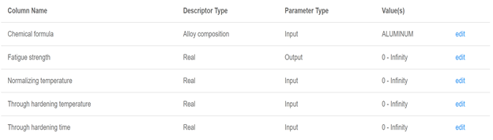

## Background
Citrination is a browser based web platform for performing...

> ## Reading and Video Tutorials
> Here are some additional resources that may help with using the Citrination platform. 
>  
> [Citrination Tutorial Series](https://www.youtube.com/channel/UC_cSbvZGp2_Mb1JHI_ZF-3w/videos)
>  
> [Citrination Knowledge Base](https://help.citrination.com/knowledgebase)
{: .callout}
  
> ## Activity: Introduction to Citrination
>  
>1. Log in to [Citrination](https://citrination.com/). You will either need to create an account or you can use your Google log in. We recommend using either Chrome or Safari, as in the past Citrination has had some errors with FireFox and you may be missing some crucial data (this may be fixed).  
>  
>2. Create a data set in Citrination & create a data view using it ([Tutorial on uploading data to Citrination](https://youtu.be/g9DTHnIp1kQ))  
>    2.1. Click on the Add Data tab at the top in Citrination. Then select Create new dataset.  
>    2.2. Title your data set “Intro to Citrination”. You do not need to select a specific team.  In the Ingester drop down, select: Citrine: Template CSV  
>    2.3. Download [the IMMI 20.csv practice dataset file](../data/IMMI_20.csv) to your local computer. Then upload this data set to Citrination. When ingestion is completed, if you click on Datasets at the top and then select My Datasets, you will see your dataset with an ID, Dataset name, record count, privacy setting contributor and date added. You should have 22 records in your data set.  
>  
>3. Create a Data View predicting fatigue strength in Citrination using this data.  
>    3.1. At the top, click on the Data Views tab. Click Create new data view.  
>    3.2. The top of the page says Search Datasets. If you scroll down a little, you’ll see Selected Datasets. Select My Datasets and you should see your own file. Click the checkbox to the right of your file. Scroll to the top of the page and click Next (at the top right).  
>    3.3. The next page is Select properties for column headers. From the properties column (these are the columns in your csv file), select Include All (next to the search icon). Then click the Next button at the top, right of the screen.  
>    3.4. Name your dataview file and save. Citrination will ask if you want to configure machine learning for this dataset - click Configure Now. This step allows you to tell Citrination which data columns will be used for the inputs in your model, which should be ignored, and which will be outputs. 
>    3.5. Change your inputs and outputs in the Data View using the “edit” button on the right. Be sure to click save at the top right after changing the inputs and outputs. Your Data View should have the following configurations:  
>        3.5.1. Inputs to Data View: Formula, Normalizing Temperature, Through Hardening Temperature, Through Hardening Time  
>        3.5.1. Outputs to Data View: Fatigue Strength  
>    3.6. In summary, this is what your machine learning configurations should look like when finished:  
>  
>    3.7. The Data View should be done training in &lt; 5 minutes. TIP: click on the “Search” in the ribbon at the top of the page after saving your Data View. This will bring up the full set of options in the top ribbon.  
>    3.8. At the top, click Data View. Under Private, find your Dataview file and click on the name of the file. Near the top you will have a Reports option, click on that and then select Model Report and expand the Property Fatigue Strength bar. This will contain all information about the model results, including metrics on the performance of the random forest. Look over the results of this Data View.  
>        3.8.1. How many estimators (trees) were used in the random forest? You can find this in the Model Settings Section.  
>        3.8.2. How many folds were used in cross validation? Again this is in model settings  
>        3.8.3. In the Important Features section how many features does it list? Do you recognize any of them?  
>        3.8.4. Notice only 21 training examples were used. Which record was missing from the training? Why?  
>    3.9. Overall how does the model seem to be performing? You can get an idea of this qualitatively by looking at the generated parity plot of the model predictions plotted on one axis and the known values from the dataset on the other. This type of scatter plot is called a parity plot and the closer the points are to a 45 degree line the better the model is performing.  
>    3.10. Quantitatively, Citrination also reports a Root Mean Squared Error (RMSE) score along with the plot. How big is the RMSE? And how large is it compared to the size of our fatigue strength data? These are all things that can give us information on performance.  
>    3.11. Save these results as a PDF for your weekly report. You can do this by printing the page and changing the printing location to “Save to PDF.”  
>  
>4. Update your data set on Citrination.  
>    4.1. In your local copy of the IMMI_20.csv file, remove the training sample that was not included in the Data View. Are there any other samples that have suspicious fatigue strengths?  
>    4.2. Go back to the Data Set tab, click on your data set. When it opens, click “Create new version” (under the name of your dataset). Citrination will ask you to confirm dataset depreciation, click confirm.  
>    4.3. With this new version we will reupload the edited local copy of the IMMI_20.csv  file now that the bad data has been removed  
>    4.4. In the second menu near the top of the page, click Files, then click Add Files.  Then upload your edited csv the same way you uploaded the original file in Step 2. (Upload the corrected CSV to this data set using the Citrine: Template CSV ingestor and wait for ingestion to be completed. You should have 19 records.)  
>  
>5. Re-examine the Data View.  
>    5.1. Once the edited file is uploaded, click on Data View at the top. Then under Private, find your Data View and click on the file name. Towards the top of the page on the right, click the Retrain button and then ok.  
>    5.2. Updating your data set should update the Data View on Citrination. However, the model should take a few minutes to retrain. Once the model has retrained, save these results as well.  
>    5.3. After the model has retrained, open the Model report as you did in Step 3 h.  
>  
>6. Materials design  
>    6.1. Citrination has a cool tool for designing new materials based on the machine learning model we have generated. Let’s see if we can find a new material with high fatigue strength.  
>    6.2. Navigate to the “Design” tab where we can set up some constraints for our search for high fatigue strength materials. To start, leave everything as default and make sure at the bottom under the “target” section it is set to search for fatigue strength and search for “max”.  
>    6.3. Simply click the “run” button at the top of the page to begin using our existing ML model to search for compositional space for the highest fatigue strength possible. This may take a few minutes. Is the predicted fatigue strength for any of the found materials significantly higher than any of the points within our dataset?  
>    6.4. Record your predictions and see if you can change some settings to improve your results. For example, try searching for a longer time or constraining results to only use elements that are earth abundant (try Google searching for a list).  
>  
>7. Repeat this process from Step 4 (updating your data set) for the [IMMI_50.csv](../data/IMMI_50.csv) and [IMMI_400.csv](../data/IMMI_400.csv). Be sure to save PDF’s of your model reports at each step. These versions of the dataset add more data points. Does the model improve as we add more data?  
{: .challenge}
  


