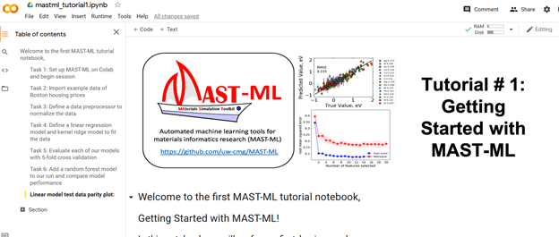

## Background

The MAterial Science Toolkit for Machine Learning (MAST-ML) is a machine learning workflow software package built in python that leverages several other underlying python libraries to enable users to build and test models with little to no python background.
The toolkit generates common outputs such as parity plots, learning curves, and standard error metrics which enables new users to easily get to the information needed to make informed decisions about how their models are performing.
  
Google Colab is a cloud computing resource that allows us to run software on the cloud instead of our local computer, giving access to more computing power and a standardized computing environment.
We're going to use Google Colab to run the the MAST-ML software in a series of tutorials that demonstrate how to perform a basic machine learning workflow.
  
MAST-ML is divided into a number of sections which allow users to perform ML workflows. These include: Data Importation, Data Cleaning, Feature Generation, Feature Engineering, Data Splitting (Train/Test/Validation), Model Assessment, and Model Optimization
By giving the user freedom to choose methods at each of these workflow steps MAST-ML is a extremely customizable in its use compared to some other software tools which are much more structured in the methods used. 
For example the [Citrination](https://citrination.com/users/sign_in){:target="_blank"} web tool focuses on building and training random forest models but doesn't give the flexibility to explore other model types.
  
> ## For those with more interest in the python programming itself
>  
> If you have a little more programming background you may be interested to check out the [github page](https://github.com/uw-cmg/MAST-ML){:target="_blank"} for the code below to see a bit about how it’s structured. There is usually ongoing efforts in the Informatics Skunkworks group at UW-Madison to improve and add features to MAST-ML so if this is something you might be interested in let us know!  
>  
> For more detailed information on the structure of MAST-ML please see the [MAST-ML Documentation](https://mastmldocs.readthedocs.io/en/latest/){:target="_blank"}.  
> There are also several other Jupyter Notebooks included there that demonstrate additional functionality in MAST-ML that is not covered in this module.  
{: .solution}  

> ## Activity: Your First MAST ML Run  
>
>It’s time to conduct your very first MAST-ML run! For this first run, we will set up a notebook in Google Colab and demonstrate how to call the MAST-ML package to perform machine learning and data science workflow steps.
>  
>1. Login to [Google Colab](https://colab.research.google.com/){:target="_blank"} in your browser. NOTE: Each time you return to Google Colab you will need to rerun the setup instructions as Colab will delete your previous work after signing off.  
>2. Download the [MASTML_Colab.ipynb](https://drive.google.com/file/d/1Bi4WDCUR_kX5TgZvUwyCTmcjyaTEAkvB/view?usp=sharing){:target="_blank"} notebook to your local computer. This notebook contains python code to install MAST-ML in the Colab environment and introduces you to the basic ways we can interact with MAST-ML to perform machine learning workflows.  
>3. Upload the MASTML_Colab.ipynb file to Colab using File -> Upload Notebook.  
>4. With the notebook uploaded you should see something like this, from here you should be able to follow along with the instructions in the notebook:  
>  
> 
{: .challenge}



