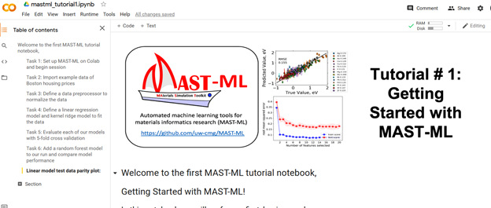

## Background

MAST-ML is a machine learning workflow software package built in python that leverages several other underlying python libraries to enable users to build and test models with little to no python background.  

If you have a little more programming background you may be interested to check out the [github page](https://github.com/uw-cmg/MAST-ML) for the code below to see a bit about how it’s structured. There is usually ongoing efforts in the Skunkworks to improve and add features to MAST-ML so if this is something you might be interested in let us know!  
  
For more detailed information on the structure of MAST-ML please see the [MAST-ML Documentation](https://mastmldocs.readthedocs.io/en/latest/).
There are also several other Jupyter Notebooks included there that demonstrate additional functionality in MAST-ML that is not covered in this module.  

> ## Activity: Your First MAST ML Run  
>
>It’s time to conduct your very first MAST-ML run! For this first run, we will set up a notebook in Google Colab and demonstrate how to call the MAST-ML package to perform machine learning and data science workflow steps.
>  
>1. Navigate to [Google Colab](https://colab.research.google.com/) in your browser. NOTE: Each time you return to Google Colab you will likely need to rerun the setup instructions as Colab is fairly aggressive about deleting and shutting down the backend that runs all of the code.  
>2. Download the [MASTML_Colab.ipynb](https://drive.google.com/file/d/1Bi4WDCUR_kX5TgZvUwyCTmcjyaTEAkvB/view?usp=sharing) notebook to your local computer. This notebook contains python code to install MAST-ML in the Colab environment and introduces you to the basic ways we can interact with MAST-ML to perform machine learning workflows.  
>3. Upload the MASTML_Colab.ipynb file to Colab using File -> Upload Notebook.  
>4. With the notebook uploaded you should see something like this, from here you should be able to follow along with the instructions in the notebook:  
>  
> 
{: .challenge}



