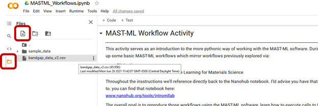

**Modifying Workflows with MAST-ML**  
  
MAST-ML is a machine learning workflow software package built in python that leverages several other underlying python libraries to enable users to build and test models. This activity shows how we can setup and perform a machine learning workflow and also gives an opportunity to modify this workflow.  
  
We will be using Google Colab to perform all of our computing so to begin you download the the .ipynb notebook file, the bandgap_data_v2.csv, and the generated_features.xlsx files to your local computer.   
  
Then upload the notebook file using the File dropdown menu option “upload notebook”, or the popup you get when first opening Colab.  
  
With the notebook running then upload the data file “bandgap_data_v2.csv” and “generated_features.xlsx” using the upload button highlighted in red below.  
  
    
  
All further instructions are contained within the notebook file directly.  
  
  
  
Note: For this activity I am referencing a previous workflow that was performed in the ML lab activity hosted on nanohub here: https://nanohub.org/tools/intromllab   
If you haven’t gone through that activity it may be useful to go through both side by side. One goal of this activity is to show how MASTML can be used to mirror previous machine learning workflows, so seeing them both happen side by side could be a useful way to interact with both.  
  



